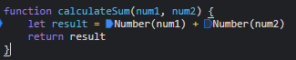

1. The type of result is a string instead of an integer. This causes the + operator to concatenate the two digits instead of adding their integer values.
2. You can fix the bug by converting num1 and num2 from strings to numbers. 
3. citylots.png
4. part2.js
5. 11.7 MB
6. 2.20 s
7. Mozilla/5.0 (Windows NT 10.0; Win64; x64) AppleWebKit/537.36 (KHTML, like Gecko) Chrome/90.0.4430.85 Safari/537.36
8. Apache
9. Tue, 26 Jan 2021 22:14:13 GMT
10. application/json
11. fetchData